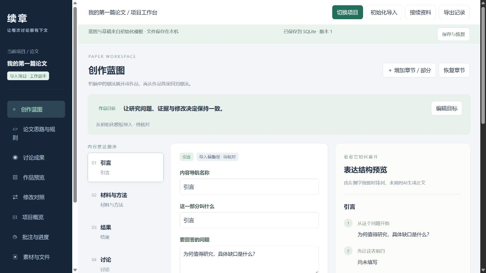

# 续章 Xuzhang

让每次讨论都有下文。一个保存在本机的研究写作工作站：继续在 Codex 对话，在续章里管理创作蓝图、证据、草稿、意见和修改验收。

**当前为 Windows x64 测试版，面向单人本机使用。**



## 下载即用

1. 在 [Releases](https://github.com/lingguang666/xuzhang/releases) 下载 `xuzhang-…-windows-x64.zip`，不要下载 Source code 作为运行包。
2. 右键“全部解压”，放到一个固定目录。不要在压缩包预览里直接运行。
3. 双击 **Start-Xuzhang.cmd**。它会打开浏览器里的续章。
4. 点击“初始化导入”，选择论文模板，填写或导入 Codex 整理的 JSON。
5. 用完双击 **Stop-Xuzhang.cmd** 停止服务。关闭网页不会停止后台服务。

运行包自带 Node.js、Python、SQLite 和所需依赖。无需管理员权限，无需自己安装这些运行环境。Windows 10/11 x64；macOS、Windows ARM64 未打包验证。

## 可以做什么

- 独立项目与论文预设；全篇思路、章节分论点和表达安排。
- 草稿原文旁批注、选中文字着色、修改进度。
- 更新并查看最新改动；按修改阶段查看历史正文、思路与蓝图，新增文字仅在对应阶段标红。
- 首次创建项目确认素材保存位置，自动生成打开工作站的入口；资料库可打开原文件。
- 导入素材，查找 TXT/Markdown、DOCX 与文字层 PDF，返回原处及附近内容。
- 决定替代、证据编号、反例、条件与使用位置；关联变化生成待检查提醒。
- 一次讨论整组保存，并逐组接受、要求修改或恢复为新版本；冲突时保护后续编辑。
- 通过 MCP 让 Codex 直接读取和写入选定项目；23 个工具。

有证据链接不代表论证成立。“AI已修改”与“作者已确认”分别记录。

## 数据与连接

默认数据目录为 `%LOCALAPPDATA%\Xuzhang\data`。双击 **Open-Data.cmd** 可打开它。数据库保存在这里，与解压的软件目录分开；新项目的素材按初始化时确认的位置保存到项目文件夹中的“续章资料”。完整备份需要同时保留数据库和各项目素材目录。内置的是通用入门示例，不含开发者论文、实验数据或批注。

程序只监听本机 `127.0.0.1`。素材不会由工作站自动上传到云端；连接 AI 后，通过 MCP 读取的内容会进入该 AI 的处理流程。使用者决定接入哪个客户端、处理哪个项目。

Codex 接入见 [连接说明](docs/codex.md)。普通网页功能可独立使用；本软件不包含 AI 模型或 Codex 账号。

备份、升级及故障处理见 [使用说明](docs/usage.md)。

## 当前边界

暂不支持扫描件 OCR、语义检索、多人协作、云同步、全文 Word 往返编辑、正文段落增删重排、公式及图表结构编辑。素材导入 Word 不等于将其完整排版导入正文；正文通过初始化模板导入。

恢复按整条记录检查冲突，同一记录有后续编辑时拒绝整组恢复。外部文件在读取时检查变化，没有后台目录监控。网页“备份数据库”只备份数据库；完整备份还需包含素材目录。

## 开发运行

先克隆本仓库源码。开发运行需要 Node.js 24 LTS（>=24.11）及 Python 3.12+。PDF 提取需要 `pypdf==6.10.0`。

```sh
npm ci --ignore-scripts
python -m pip install pypdf==6.10.0
npm run build
npm start
```

`XUZHANG_PYTHON` 可指定 Python 可执行文件；`XUZHANG_DATA_ROOT` 可指定独立数据目录。MCP 和网页应使用相同目录。测试：`npm test`（需要 Python/pypdf）。Windows 打包：`npm run package:windows`。打包脚本验证官方运行环境下载的 SHA-256，使用明确文件清单，不包含项目数据。

## 许可

MIT，见 [LICENSE](LICENSE)。第三方组件保留各自许可，见 [THIRD_PARTY_NOTICES.md](THIRD_PARTY_NOTICES.md)。本项目与 OpenAI、Nature 无隶属或背书关系。论文预设是辅助工作规则，不是期刊投稿合规保证。
